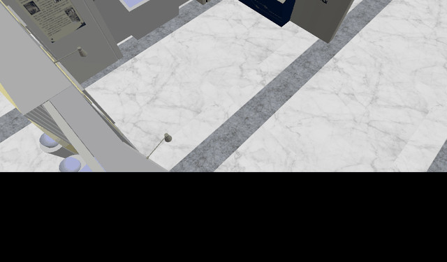

# ROS 2 仿真与教学

本工作区包含 32 个 ROS 2 包，涵盖话题通信、服务通信、动作通信、参数系统、TF 坐标变换、URDF 建模、Gazebo 仿真、SLAM 建图、Nav2 自主导航和 xArm6 机械臂仿真，以及一个完整的 ISCAS Museum 仿真场景。

## 环境

| 组件 | 版本 |
|------|------|
| 操作系统 | Ubuntu 24.04 (WSL2) |
| ROS 2 | Jazzy Jalisco |
| Gazebo | Sim Harmonic (v8) |
| 构建工具 | colcon + ament |

## 目录结构

```text
├── src/
│   ├── robot_sim_demo/              Gazebo 仿真核心包
│   │   ├── launch/gazebo2.launch.py 主启动入口
│   │   ├── models/                  机器人、博物馆、地面模型
│   │   ├── worlds/museum.sdf       仿真世界
│   │   ├── config/                  ROS-Gazebo 桥配置
│   │   ├── gui/                     Gazebo GUI 配置
│   │   └── wheeltec_robot_urdf/     Wheeltec URDF/STL 资源
│   ├── xarm/                        xArm6 + Gazebo Harmonic + MoveIt 2 仿真
│   ├── navigation_sim_demo_ros2/    Nav2 导航仿真
│   ├── slam_sim_demo_ros2/          SLAM 建图仿真
│   ├── tf_follower_ros2/            TF 跟随控制器
│   ├── topic_demo_py/               话题通信 (Python)
│   ├── topic_demo_cpp/              话题通信 (C++)
│   ├── topic_demo_interfaces/       话题消息接口
│   ├── service_demo_py/             服务通信 (Python)
│   ├── service_demo_cpp/            服务通信 (C++)
│   ├── service_demo_interfaces/     服务接口
│   ├── action_demo_py/              动作通信 (Python)
│   ├── action_demo_cpp/             动作通信 (C++)
│   ├── action_demo_interfaces/      动作接口
│   ├── param_demo_py/               参数系统 (Python)
│   ├── param_demo_cpp/              参数系统 (C++)
│   ├── tf_demo_py/                  TF 坐标变换 (Python)
│   ├── tf_demo_cpp/                 TF 坐标变换 (C++)
│   ├── name_demo_cpp/               命名空间与参数 (C++)
│   ├── msgs_demo_interfaces/       综合消息接口
│   └── lab_code/                    教学实验包（Ch02-Ch11）
│       ├── ch02_lab/hello_pkg/      节点与日志
│       ├── ch03_lab/topic_demo/      话题通信
│       ├── ch03_lab/sensor_pub/     自定义消息
│       ├── ch03_lab/sensor_interfaces/ 传感器接口
│       ├── ch04_lab/service_demo/   服务通信
│       ├── ch05_lab/action_demo/    动作通信
│       ├── ch06_lab/param_demo/     参数系统
│       ├── ch07_lab/tf_demo/        TF 坐标变换
│       ├── ch08_lab/urdf_demo/      URDF 建模
│       ├── ch09_lab/sim_demo/       Gazebo 仿真
│       ├── ch10_lab/slam_lab/       SLAM 建图
│       └── ch11_lab/navigation_lab/  Nav2 导航
└── README.md                        本文件
```

## 安装

### 1. 安装 ROS 2 Jazzy

参考 [ROS 2 官方安装指南](https://docs.ros.org/en/jazzy/Installation.html)：

```bash
sudo apt update && sudo apt install -y \
  ros-jazzy-desktop \
  ros-jazzy-ros-gz-sim ros-jazzy-ros-gz-bridge ros-jazzy-ros-gz-image \
  ros-jazzy-navigation2 ros-jazzy-nav2-bringup ros-jazzy-nav2-simple-commander \
   ros-jazzy-slam-toolbox ros-jazzy-nav2-map-server \
   ros-jazzy-robot-state-publisher ros-jazzy-joint-state-publisher-gui \
   ros-jazzy-rviz2 ros-jazzy-ros2-control ros-jazzy-ros2-controllers \
   ros-jazzy-gz-ros2-control ros-jazzy-moveit \
   ros-jazzy-trac-ik-kinematics-plugin \
   python3-colcon-common-extensions
```

### 2. 准备 xArm 描述底层

`xarm_ros2_arm_only` 的运行依赖自定义 XBot Arm `xarm_description` `2.0.0`。该描述包不随本工作区提供，必须先在独立底层工作区中构建，并在构建或启动 xArm 前 source：

```bash
source /opt/ros/jazzy/setup.bash
cd /path/to/xarm_description_workspace
colcon build --symlink-install --packages-select xarm_description
source install/setup.bash
```

该描述包必须提供 `xarm_description/urdf/arm.urdf.xacro`，并采用 `arm_1_joint` 至 `arm_6_joint` 的关节命名。不要直接替换为使用 `joint1` 至 `joint6` 的 UFACTORY 官方描述包，除非同步迁移 Xacro、SRDF、控制器和 MoveIt 配置。

### 3. 克隆工作区

```bash
git clone https://github.com/YunxiangLuo/ROS2.git
cd ROS2
```

### 4. 编译全部包

```bash
source /opt/ros/jazzy/setup.bash
source /path/to/xarm_description_workspace/install/setup.bash
colcon build --symlink-install
source install/setup.bash
```

当前环境已验证完整构建：`Summary: 32 packages finished [3min 12s]`。

## 包清单

### 仿真核心

| 包名 | 类型 | 说明 |
|------|------|------|
| `robot_sim_demo` | Python | ISCAS Museum Gazebo 仿真：Wheeltec 机器人、传感器桥、巡航驱动 |
| `xarm_ros2_arm_only` | Python | xArm6 纯机械臂仿真：Gazebo Harmonic、ros2_control、MoveIt 2 和 RViz |
| `navigation_sim_demo_ros2` | Python | Nav2 导航栈：地图、AMCL、规划、控制 |
| `slam_sim_demo_ros2` | Python | slam_toolbox 在线建图 |
| `tf_follower_ros2` | Python | TF 跟随控制器：基于坐标变换的速度控制 |

### 通信示例

| 包名 | 语言 | 说明 |
|------|------|------|
| `topic_demo_py` | Python | 话题通信（GPS 数据发布/订阅） |
| `topic_demo_cpp` | C++ | 话题通信（GPS 数据发布/订阅） |
| `service_demo_py` | Python | 服务通信（Greeting 请求/响应） |
| `service_demo_cpp` | C++ | 服务通信（Greeting 请求/响应） |
| `action_demo_py` | Python | 动作通信（DoDishes 洗碗任务） |
| `action_demo_cpp` | C++ | 动作通信（DoDishes 洗碗任务） |

### 接口包

| 包名 | 说明 |
|------|------|
| `topic_demo_interfaces` | `msg/Gps`（state, x, y） |
| `service_demo_interfaces` | `srv/Greeting`（name, age → feedback） |
| `action_demo_interfaces` | `action/DoDishes`（dishwasher_id → total_dishes_cleaned, percent_complete） |
| `msgs_demo_interfaces` | ROS 1 迁移的综合消息接口（24 个 msg/srv/action） |
| `sensor_interfaces` | `msg/SensorData`（temperature, humidity, pressure, device_id） |

### 其他示例

| 包名 | 语言 | 说明 |
|------|------|------|
| `param_demo_py` | Python | 参数声明、修改、删除、回调 |
| `param_demo_cpp` | C++ | 参数系统 |
| `tf_demo_py` | Python | TF2 广播、监听、坐标变换 |
| `tf_demo_cpp` | C++ | TF2 广播、监听、四元数转换 |
| `name_demo_cpp` | C++ | 命名空间、节点名、参数 |

### 教学实验包（lab_code）

| 章节 | 包名 | 说明 |
|------|------|------|
| Ch02 | `hello_pkg` | 节点创建、日志分级 |
| Ch03 | `topic_demo` | 话题发布/订阅/QoS/正方形轨迹 |
| Ch03 | `sensor_pub` | 自定义 SensorData 消息发布 |
| Ch03 | `sensor_interfaces` | SensorData.msg 定义 |
| Ch04 | `service_demo` | AddTwoInts 服务 |
| Ch05 | `action_demo` | DoDishes 动作（异步执行） |
| Ch06 | `param_demo` | 参数声明/Launch 配置 |
| Ch07 | `tf_demo` | TF2 广播/监听 |
| Ch08 | `urdf_demo` | URDF/Xacro 建模 + RViz |
| Ch09 | `sim_demo` | Gazebo 仿真启动 |
| Ch10 | `slam_lab` | SLAM/Cartographer/AMCL |
| Ch11 | `navigation_lab` | Nav2 导航/航点/恢复 |

## 快速开始

### 1. 启动仿真

```bash
ros2 launch robot_sim_demo gazebo2.launch.py
```

Gazebo 打开后，Wheeltec Mini AKM 机器人在 ISCAS Museum 场景中心自动巡航。

### 2. 检查话题

```bash
ros2 topic list
ros2 topic echo /clock --once
ros2 topic echo /scan --once
ros2 topic echo /odom --once
```

### 3. 运行 SLAM 建图

```bash
# 终端 1
ros2 launch robot_sim_demo gazebo2.launch.py gui:=false rviz:=false drive:=false

# 终端 2
ros2 launch slam_sim_demo_ros2 slam_demo.launch.py use_gazebo:=false use_rviz:=true

# 终端 3
ros2 run slam_sim_demo_ros2 slam_map_runner --ros-args -p use_sim_time:=true
```

### 4. 运行 Nav2 导航

```bash
# 终端 1
ros2 launch robot_sim_demo gazebo2.launch.py gui:=false rviz:=false drive:=false

# 终端 2
ros2 launch navigation_sim_demo_ros2 nav2_demo.launch.py use_gazebo:=false use_rviz:=true

# 终端 3
ros2 run navigation_sim_demo_ros2 nav_goal_runner --ros-args -p use_sim_time:=true -p goal_x:=1.0 -p goal_y:=0.0
```

## 测试

全部 29 项测试通过：

```bash
# 运行所有有测试的包
for pkg in action_demo_py topic_demo_py service_demo_py param_demo_py tf_demo_py \
  tf_follower_ros2 navigation_sim_demo_ros2 slam_sim_demo_ros2 robot_sim_demo; do
  echo "=== $pkg ==="
  (cd src/$pkg && python3 -m pytest test/ -q)
done
```

| 包名 | 测试数 | 结果 |
|------|--------|------|
| `robot_sim_demo` | 7 | 全通过 |
| `tf_follower_ros2` | 7 | 全通过 |
| `navigation_sim_demo_ros2` | 5 | 全通过 |
| `slam_sim_demo_ros2` | 6 | 全通过 |
| `action_demo_py` | 1 | 通过 |
| `topic_demo_py` | 1 | 通过 |
| `service_demo_py` | 1 | 通过 |
| `param_demo_py` | 1 | 通过 |
| `tf_demo_py` | 1 | 通过 |
| **合计** | **29** | **全部通过** |



## 嵌套包说明

`src/robot_sim_demo/wheeltec_robot_urdf/` 是一个独立的 ament_cmake 包，包含 Wheeltec 机器人的 URDF 和 STL 网格资源。由于它嵌套在 `robot_sim_demo` 包内部，colcon 不会单独发现它，而是作为 `robot_sim_demo` 的数据文件安装到 `share/robot_sim_demo/wheeltec_robot_urdf/`。
